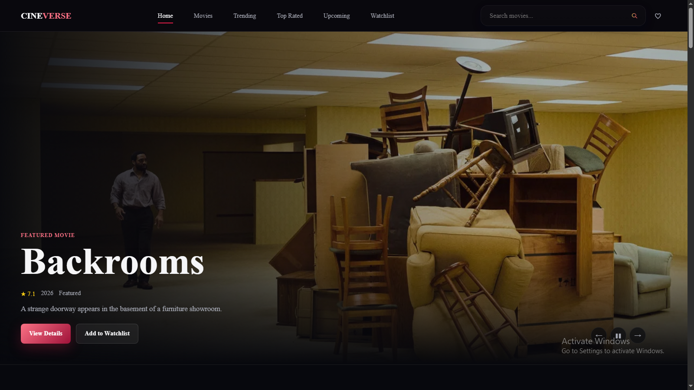

# CineVerse Movie Discovery

CineVerse is a premium, modern, and fully responsive movie discovery web app built with a focus on clean UI design, dynamic movie data, responsive layouts, and interactive user experiences.

## Live Demo

[View CineVerse Movie Discovery](https://cineverse-movie-discovery.netlify.app/)

## 📸 Screenshots

### Home Page



### Movie Discovery & Filters


### Movie Details


### Responsive Design


## Features

- Fully responsive movie discovery UI
- Trending, popular, top-rated, and upcoming sections
- Genre, sort, and year-based discovery filters
- Debounced movie search with history
- Movie details modal with cast and trailer link
- Watchlist and recently viewed persistence using LocalStorage
- Loading skeletons, empty states, and error handling

## Tech Stack

- HTML5
- CSS3
- JavaScript (ES6+)
- Fetch API
- TMDB API
- Netlify Functions
- LocalStorage

## Project Structure

```text
index.html
css/
├── variables.css
├── style.css
└── responsive.css
js/
├── main.js
├── api.js
├── ui.js
├── search.js
├── watchlist.js
└── storage.js
assets/
├── search-icon-2.svg
└── screenshots/
    ├── home.png
    ├── movie details.png
    ├── movie filter.png
    └── responsive design.png
netlify/
└── functions/
    └── tmdb.js
README.md
```

## Local Development

### Option 1: Open directly

Open index.html in a browser for the static UI preview. API-backed features
require the local server or Netlify development setup below.

### Option 2: Run a local server

```bash
python -m http.server 8000
```

Then open:

```text
http://localhost:8000
```

### Netlify local development

This app uses a Netlify Function to keep the TMDB API key on the server side.

1. Create a local `.env` file and do not commit it:

```bash
TMDB_API_KEY=your_tmdb_api_key_here
```

2. Run the app locally with Netlify CLI:

```bash
npx netlify-cli@latest dev
```

3. In production, add `TMDB_API_KEY` in Netlify environment variables under Site settings → Build & deploy.

## Notes

This project was built as a practical frontend project to strengthen my skills in JavaScript, API integration, responsive design, and creating interactive user experiences.

## Author

- GitHub: [@syedfurqanullah](https://github.com/syedfurqanullah)
- LinkedIn: [Syed Furqan Ullah](https://www.linkedin.com/in/syed-furqan-ullah/)
